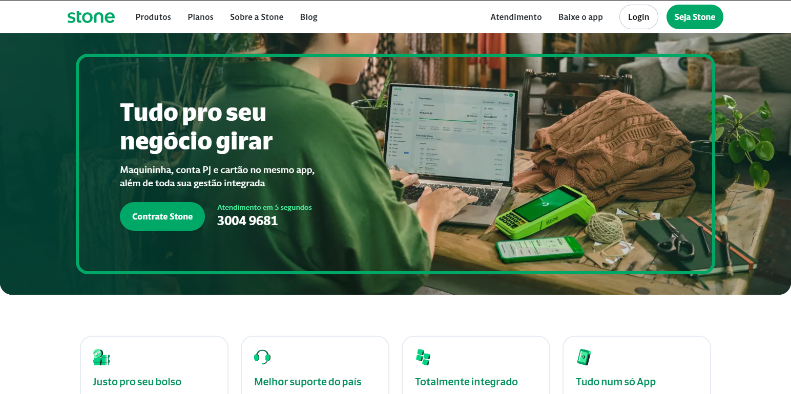

# Stone Landing Page Clone



## Descrição

Este projeto é um clone da página inicial do site da Stone, desenvolvido utilizando Next.js, Typescript, Tailwind CSS, Keen Slider e Hamburger React. O objetivo é fornecer uma recriação fiel da interface da página inicial da Stone, demonstrando a integração dessas tecnologias modernas e populares.

[Link do Site Clone](https://stone-landing-page-kappa.vercel.app)

[Link do Site Original](stone.com.br)

## Tecnologias Utilizadas

- **Next.js:** Um framework React que possibilita a construção de aplicativos web escaláveis e eficientes.

- **Typescript:** Uma linguagem superset do JavaScript que adiciona tipagem estática ao código, melhorando a manutenção e escalabilidade.

- **Tailwind CSS:** Um framework de utilitários CSS altamente personalizável, que simplifica o desenvolvimento de interfaces responsivas.

- **Keen Slider:** Uma biblioteca de slider/carrossel leve e flexível para React, facilitando a criação de experiências de navegação intuitivas.

- **Hamburger React:** Um componente React para criar menus de navegação responsivos estilo "hamburger".

## Como Executar

1. Clone este repositório em sua máquina local.
2. Instale as dependências usando o comando:
   ```
   npm install
   ```
3. Inicie o aplicativo com:
   ```
   npm run dev
   ```
4. Abra o aplicativo no seu navegador.

## Contribuições

Contribuições são bem-vindas! Sinta-se à vontade para abrir problemas ou enviar pull requests.
